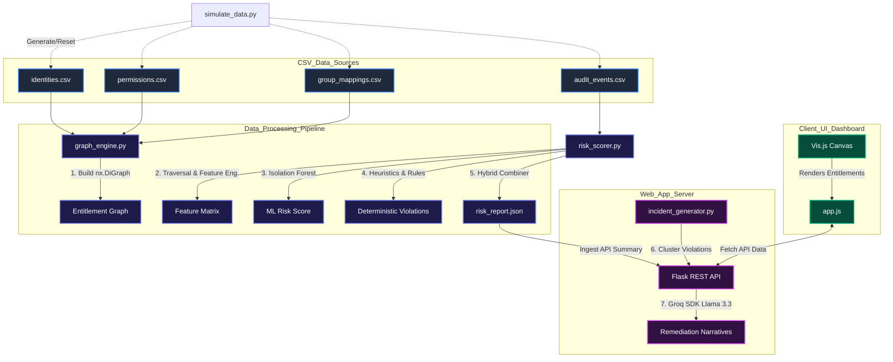
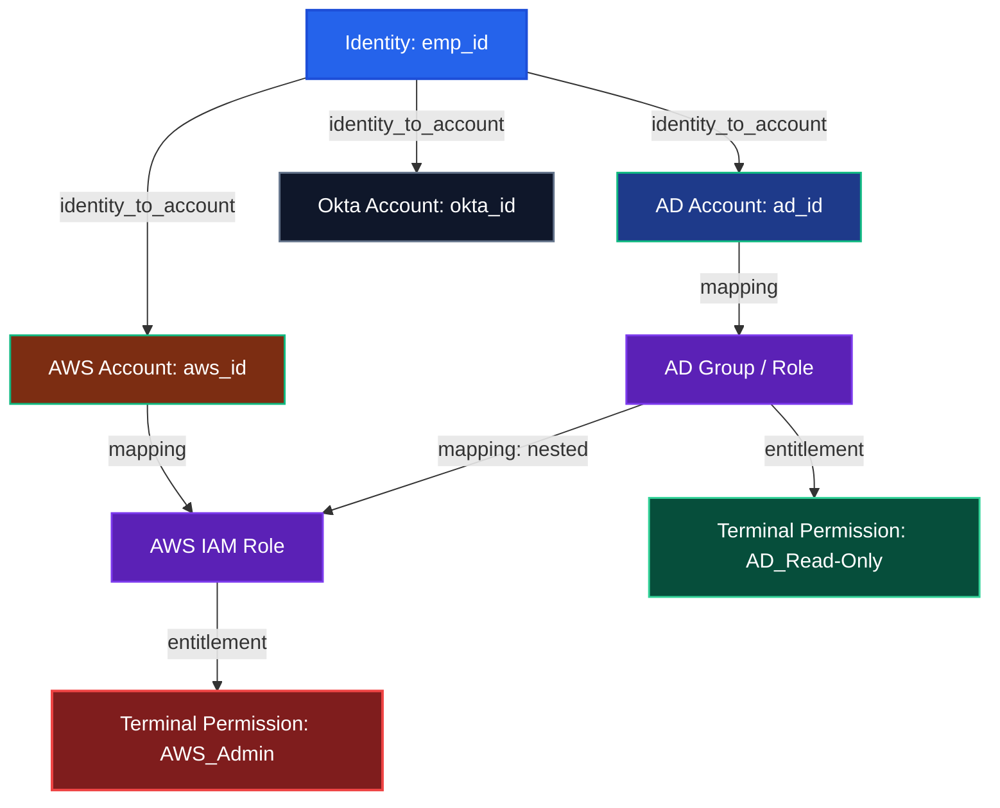
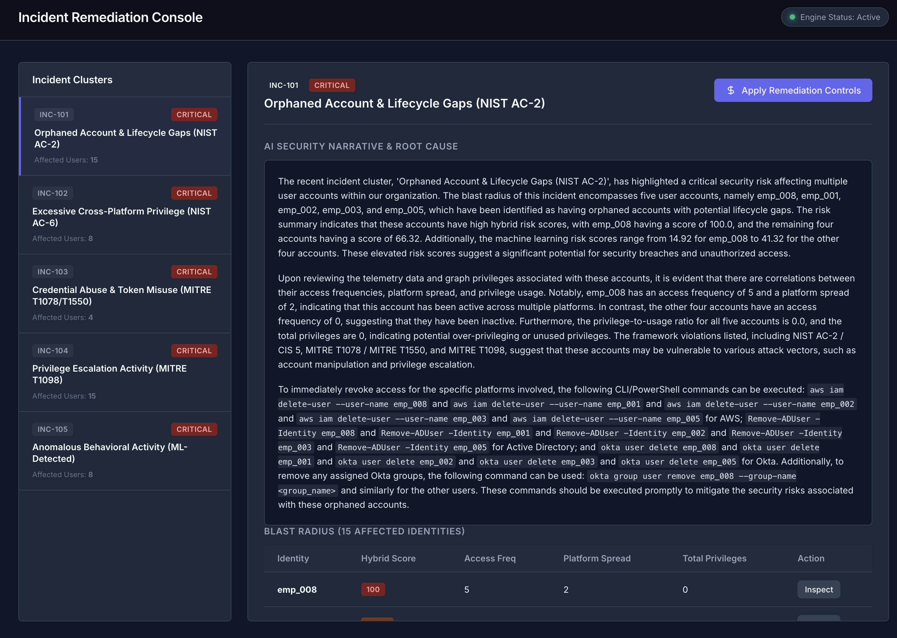
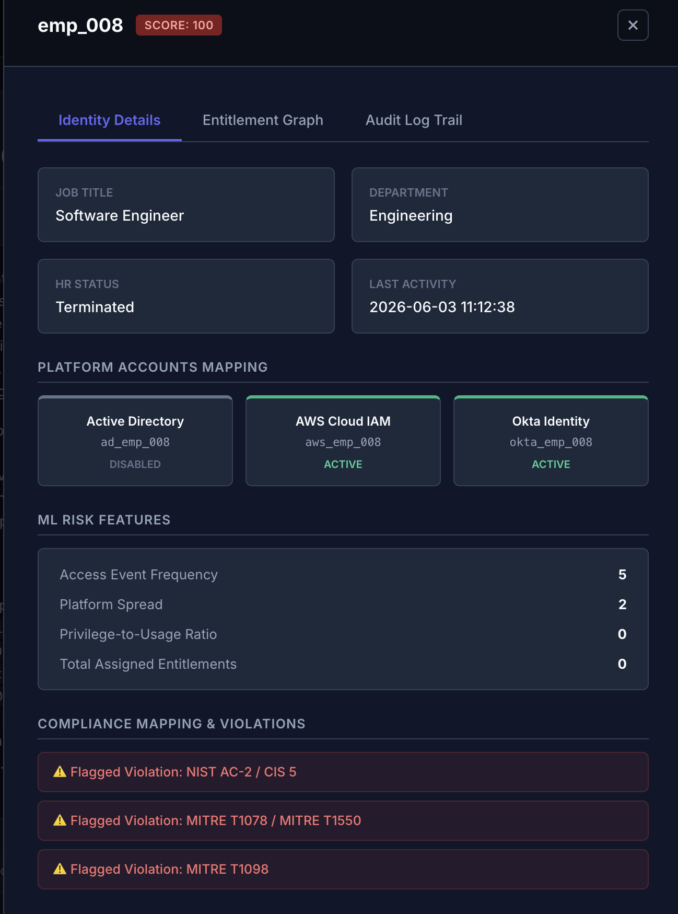
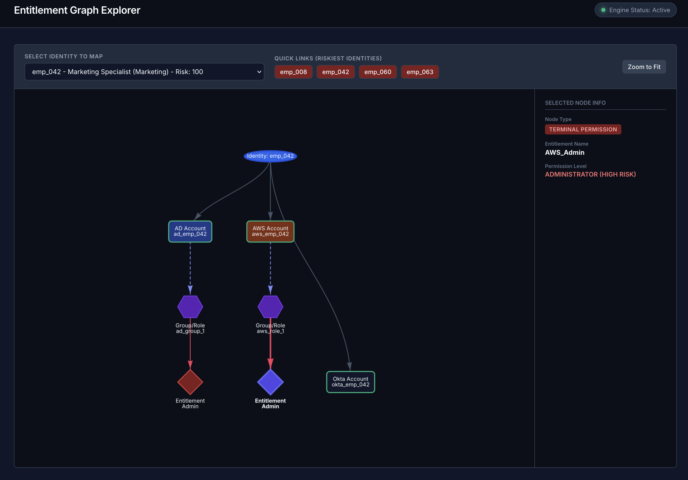
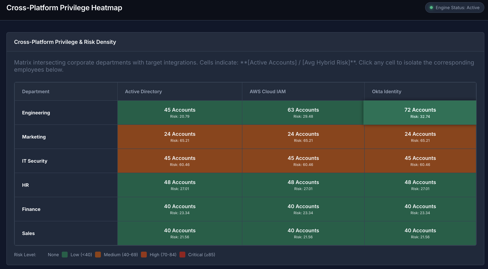
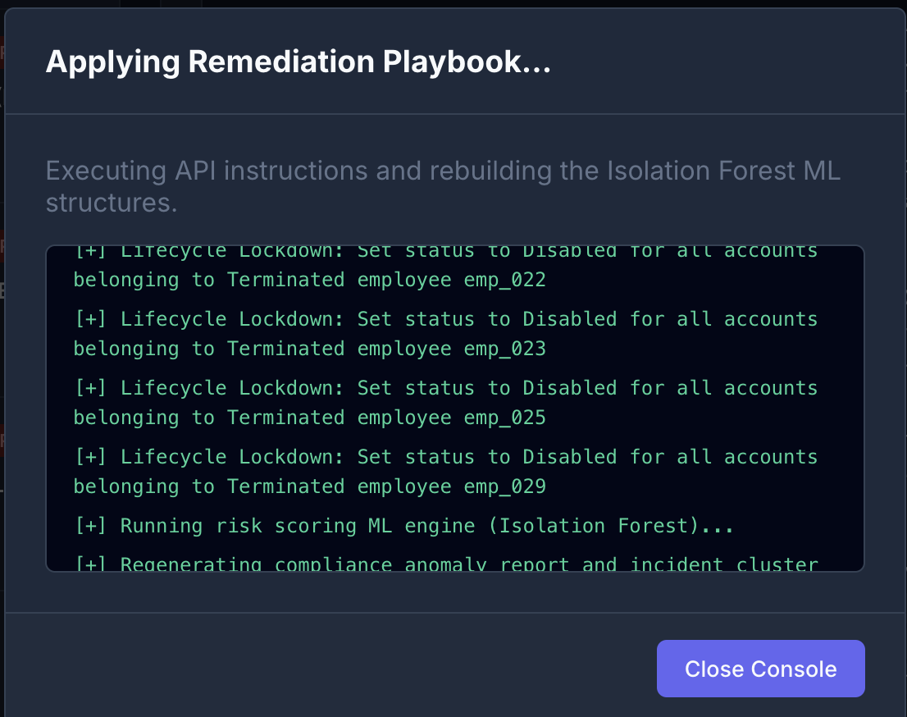

# SprawlBlock: Enterprise IAM Privilege Sprawl & Threat Detection System
## System Architecture & Technical Documentation

SprawlBlock is a premium, enterprise-grade identity risk analytics platform designed to solve **Problem Statement 4 (IAM Privilege Sprawl and Threat Detection)**. The system ingests disparate identity data, group memberships, and platform-specific audit events to build a unified, multi-platform Entitlement Graph. It applies a hybrid anomaly detection pipeline—combining structural graph traversal, machine learning (Isolation Forest), and deterministic rule matches—to surface, cluster, and remediate compliance and security risks.

---

## 1. High-Level System Architecture
    
SprawlBlock is built on a decoupled, modular pipeline running on a lightweight Python/Flask backend and a dynamic Vanilla HTML5/CSS3/JavaScript frontend. 

### Data Flow Diagram

### Module Descriptions

1. **Simulation Engine (`simulate_data.py`)**: Generates realistic synthetic datasets (300 identities, 150 nested groups, 800 audit events) containing specific injected anomalies such as orphaned account gaps (12%), over-privileged marketing users (8%), and token abuse (4%).
2. **Graph Engine (`graph_engine.py`)**: Utilizes `networkx` to build a directed acyclic graph (DAG) representing the enterprise-wide entitlement landscape. It provides functions to traverse paths and resolve downstream group nesting and platform permissions.
3. **Risk Scorer (`risk_scorer.py`)**: Consolidates structural graph traversal and behavioral event streams into a Pandas DataFrame. It trains an Isolation Forest to score behavioral outliers and maps explicit policy failures (like dormant administrators or off hours spikes) to key regulatory compliance frameworks (NIST SP 800-53, MITRE ATT&CK, GDPR, CIS).
4. **Incident Engine (`incident_generator.py`)**: Groups identities exceeding a hybrid risk score of `65.0` into logical Incident Clusters. It interfaces with the official **Groq Python SDK** to query `llama-3.3-70b-versatile` to produce natural language executive summaries and copy-pasteable remediation CLI/PowerShell commands.
5. **REST API & Web App (`app.py`)**: Houses the Flask routing system. It exposes programmatic API endpoints and manages remediation playbooks (e.g. running scripts to revoke access, updating the backend state, and reloading the dashboard).
6. **Frontend Dashboard (`index.html` & `app.js`)**: A responsive dashboard styling a premium dark mode, real-time counters, interactive Vis.js graphs, department matrix heatmaps, list filtering, and inline shell terminals to run remediation sequences.

---

## 2. Graph Entitlement Schema

To trace nested group permissions and cross-platform sprawl, SprawlBlock constructs a unified graph mapping human root identities to their technical access paths:

---

## 3. Analysis & Risk Scoring Algorithm

SprawlBlock combines unsupervised machine learning with deterministic security rule matchings to create a single unified, action-oriented **Hybrid Risk Score**.

### Step 1: Feature Engineering & The Privilege-to-Usage Ratio

For every root human identity ($i$), behavioral metrics are compiled from audit logs, and structural metrics are calculated via Graph BFS/DFS traversal:

1. **Access Frequency ($F_i$)**: Total count of logged audit events associated with any of $i$'s platform accounts.
2. **Platform Spread ($S_i$)**: Number of unique platforms (AD, AWS, Okta) from which $i$ has initiated events.
3. **Total Privileges ($P_i$)**: The count of terminal permission nodes reachable in the Entitlement Graph from $i$:
   $$P_i = \left| \{ n \in G \mid n_{\text{type}} = \text{'permission'} \land \text{path}(emp\_id_i \to n) \text{ exists} \} \right|$$
4. **Privilege-to-Usage Ratio ($R_i$)**: Meant to represent "Least Privilege" compliance. A high ratio indicates an over-privileged account that holds access it rarely uses. If a user is inactive ($F_i = 0$), the ratio is explicitly set to $0.0$ to avoid division by zero and synthetic outliers skewing the ML model.
   $$R_i = \begin{cases} 
      \frac{P_i}{F_i} & \text{if } F_i > 0 \\ 
      0.0 & \text{if } F_i = 0 
   \end{cases}$$

### Step 2: Unsupervised Machine Learning (Isolation Forest)

An **Isolation Forest** is trained to establish baseline behavioral boundaries and calculate an outlier score.

1. **Feature Vector**: For each identity, the ML model ingests:
   $$\vec{X}_i = \left[ \log(F_i + 1), \, S_i, \, \log(R_i + 1) \right]$$
   *Note: Log-transformations are applied to highly right-skewed features ($F_i$ and $R_i$) to prevent extreme outlier values from dominating the tree splits during training.*
2. **Training Setup**:
   - Algorithm: `sklearn.ensemble.IsolationForest`
   - Contamination Rate: $0.15$ (representing the estimated fraction of anomalies in the system).
3. **Normalization**: The raw anomaly decision score $d(\vec{X}_i)$ (where lower numbers signify high anomaly probability) is inverted and scaled using `MinMaxScaler` to produce a baseline **ML Risk Score** ($M_i$) in the range $[0, 100]$.

### Step 3: Deterministic Compliance Penalties

Simultaneously, the engine runs heuristic checks to catch explicit policy violations, mapped directly to security controls:

*   **Orphaned Account & Lifecycle Gaps (NIST AC-2 / CIS 5)**:
    - *Condition*: Human status is `Terminated` in the HR database, but one or more mapped platform accounts are still marked as `Active` in AD, AWS, or Okta.
    - *Penalty*: $+25$ points
*   **Dormant Administrator (NIST AC-2 / CIS 5)**:
    - *Condition*: User's last login date exceeds 30 days, yet they retain active `Admin` permissions on one or more platforms.
    - *Penalty*: $+25$ points
*   **Credential Abuse & Token Misuse (MITRE T1078 / MITRE T1550)**:
    - *Condition*: Audit logs show suspicious access flags such as `API_Call_From_Suspicious_IP` or `Use_Expired_Token`.
    - *Penalty*: $+30$ points
*   **Anomalous Off-Hours Activity (MITRE T1078)**:
    - *Condition*: `2 AM Spike` rule triggers if a user initiates $\ge 3$ API commands between 1:00 AM and 4:00 AM.
    - *Penalty*: $+30$ points
*   **Privilege Escalation Activity (MITRE T1098)**:
    - *Condition*: Logging contains administrative modifications like `AddUserToGroup_DomainAdmins` or `AttachUserPolicy_AdministratorAccess`.
    - *Penalty*: $+40$ points
*   **Excessive Cross-Platform Privilege (NIST AC-6 / GDPR Art 5)**:
    - *Condition*: Ratios exceeding standard thresholds. We isolate only active, privileged users ($F_i > 0$ and $P_i > 0$) to compute the 75th percentile ratio threshold ($T_{75}$). We define a floor of $1.0$ to protect legitimate light users:
      $$T_{\text{ratio}} = \max(T_{75}, 1.0)$$
      An AC-6 violation is flagged if:
      $$(M_i > 70 \land R_i \ge T_{\text{ratio}}) \lor R_i \ge 2.0$$
    - *Penalty*: $+20$ points

### Step 4: Hybrid Risk Combination

The final **Hybrid Risk Score** ($H_i$) aggregates the machine learning outlier metrics and policy penalties, capped at $100$:
$$H_i = \min(M_i + \sum \text{Compliance Penalties}_i, \, 100.0)$$

---

## 4. User Interface Design & Walkthrough

The SprawlBlock client-side dashboard provides security analysts with a powerful, visually responsive command center to analyze enterprise threat scores and run remediations.

### 1. Main Dashboard Overview

- **Top Metrics Row**: Highlights critical KPIs in real time, including **Total Mapped Identities**, **Active Incidents**, **Critical Threat Clusters**, **Average Platform Risk Score**, and a breakdown of connected accounts across AD, AWS, and Okta.
- **Incident Severity Distribution**: High-contrast gauges visualising active high-risk alerts that demand immediate analyst attention.

### 2. AI Incident Narratives & Executive Summaries

- **Groq Llama-3 Summaries**: Selecting an incident displays a detailed 3-paragraph executive summary detailing:
  1. The blast radius and structural risk summary.
  2. Telemetry and entitlement correlation.
  3. Interactive, copy-pasteable shell revocation scripts.
- **Blast Radius User Table**: Lists all affected identities in the cluster. Analysts can click the "Inspect" button to drill down into any user's profile.

### 3. Global Identity Risk Registry

- **Risk Registry Table**: A searchable database displaying every user's Department, Active Directory Status, AWS Status, Okta Status, and computed Hybrid Risk Score.
- **Framework Filtering**: Allows filtering by specific framework violations (e.g. NIST AC-2, NIST AC-6, MITRE T1078).

### 4. Identity Detail Panel & Audit Trails

- **Risk Profile**: Triggered by clicking any identity, this slide-out drawer displays the employee's title, department, manager, and their individual ML vs. Hybrid score.
- **Telemetry Indicators**: Displays access counts, platforms accessed, and their exact privilege-to-usage ratio.
- **Detailed Audit Trail**:
  
  Shows chronological telemetry logs with timestamps, specific platforms, executed actions, source IPs, and success/failure status.

### 5. Interactive Entitlement Mapping Graph

- **Vis.js Rendering Engine**: Displays the user's multi-platform access path.
- **Interactive Node Selection**: Hovering or clicking on a node (Identity, Account, Group, or Terminal Permission) loads granular metadata inside the inspector panel. Node shapes and colors represent criticalities (e.g., Red Diamond for admin permissions, Purple Hexagons for group bindings).

### 6. Heatmap Department Matrix

- **Integration Risk Matrix**: Color-codes platform risk (AD, AWS, Okta) across business departments (IT, Sales, HR, Marketing) using a smooth green-to-red gradient.
- **Drilldown Grid**: Clicking a cell opens a filtered list of all identities matching the matrix coordinate.

### 7. Automated Remediation Playbooks

- **Remediation Dialog**: Initiated by clicking "Execute Automated Remediation" on an incident.
- **Simulated Terminal Console**: Shows real-time execution logs (e.g., "Revoking AWS AdministratorAccess policy," "Disabling Active Directory login," "Wiping Okta sessions").
- **State Auto-Sync**: The dashboard dynamically updates all stats, maps, and risks once remediation completes.
