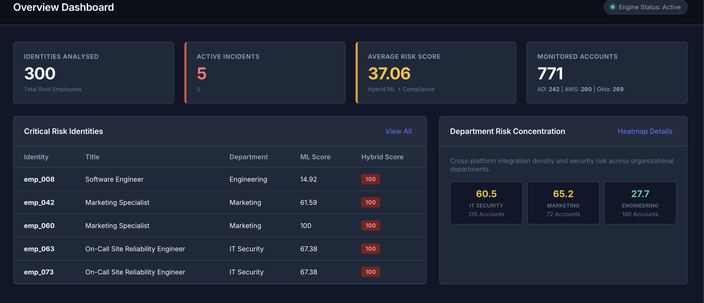
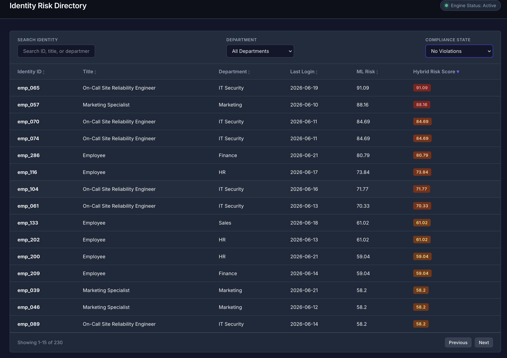
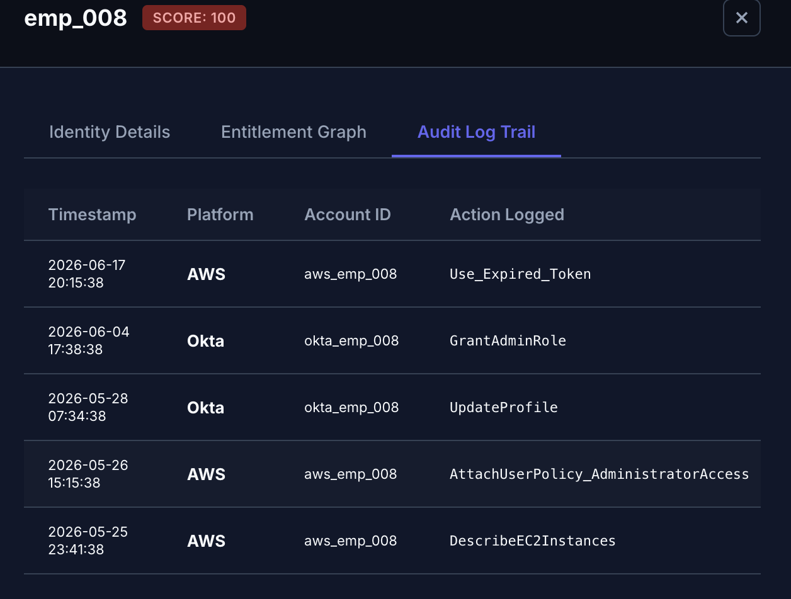

# SprawlBlock: Multi-Platform Privilege Sprawl & Threat Detection System

SprawlBlock is a premium, enterprise-grade cybersecurity identity analytics platform. It correlates data across Active Directory (AD), AWS Cloud IAM, and Okta to detect cross-platform privilege sprawl, lifecycle gaps, and active privilege abuse that single-silo directories fail to surface alone.

---

## Key Features

1. **Multi-Platform Entitlement Graph**: Traverses group nesting and federation mappings using directed graph logic (`networkx`) to resolve terminal permissions.
2. **Hybrid ML & Policy Threat Scoring**:
   - Ingests chronological telemetry audit streams to model behaviors.
   - Trains an **Unsupervised Isolation Forest** model to compute a 0-100 anomaly score based on access frequencies, platform spread, and privilege-to-usage ratios.
   - Applies deterministic compliance checks (dormant admin, off-hours spikes, token abuse, terminated offboarding leaks) mapped to **NIST SP 800-53** and **MITRE ATT&CK** controls.
3. **AI-Powered Threat Remediations**: Integrates the official **Groq Python SDK** (`llama-3.3-70b-versatile`) to generate executive incident cluster summaries and copy-pasteable CLI cleanup scripts.
4. **Interactive Dark-Mode Dashboard**: Visualizes entitlements in real time using interactive Vis.js graphs, matrix heatmaps, searchable registries, and terminal simulators to run playbooks.

---

## User Interface Walkthrough

### 1. Main Dashboard Overview

Provides real-time enterprise statistics (analyzed users, active threats, monitored credentials) alongside incident severity breakdowns.

### 2. LLM Remediation & Incident Clustering

Groups high-risk identities (>65.0) into incidents, outputting blast radius user lists and Llama-3 executive narratives.

### 3. Global Identity threat Registry

A unified interface displaying every identity, job titles, department, active directory status, AWS status, Okta status, and final computed risk scores.

### 4. Identity Detail Panel & Behaviour logs


Slides out to display the user's telemetry indicators (access ratios, platform spread) and a complete chronological audit log timeline.

### 5. Interactive Entitlement Mapping Graph

Draws the root human identity connected downstream to AD/AWS/Okta accounts, group memberships, and terminal permissions. Hovering or clicking nodes inspects their attributes.

### 6. Heatmap Department Matrix

Grid matrix displaying platform risks across business units (IT, Marketing, Sales, HR), allowing matrix coordinate cell drilldowns.

### 7. Automated Playbooks Console

Runs remediation scripts (e.g. revoking group policies, disabling AD logins) with standard terminal outputs.

---

## How to Install and Run

### Prerequisites
- Python 3.8 or higher
- Pip package manager
- A Groq API Key (Optional; required for LLM summaries)

### Step 1: Clone the Repository
```bash
git clone https://github.com/VinayakKumarSingh/SprawlBlock.git
cd SprawlBlock
```

### Step 2: Set Up Virtual Environment
Create and activate a clean Python virtual environment:
```bash
python3 -m venv venv
source venv/bin/activate
```

### Step 3: Install Dependencies
Install all required modules from the requirements manifest:
```bash
pip install -r requirements.txt
```

### Step 4: Environment Configurations
Create a `.env` file in the root workspace directory and configure your Groq credential:
```env
GROQ_API_KEY="your_groq_api_key_here"
```

### Step 5: Execute Data Simulation Engine
Generate a realistic simulated enterprise footprint consisting of 300 identities, 150 group nested mappings, and 800 audit events:
```bash
python simulate_data.py
```
*Outputs: `identities.csv`, `permissions.csv`, `group_mappings.csv`, and `audit_events.csv`.*

### Step 6: Execute the Hybrid Scoring Engine
Run graph builds, train the Isolation Forest, and compute final hybrid threat reports:
```bash
python risk_scorer.py
```
*Outputs: `risk_report.json`.*

### Step 7: Execute the Incident Clustering Engine
Consolidate alerts and generate natural language summaries using Groq:
```bash
python incident_generator.py
```
*Outputs: `clustered_incidents.json`.*

### Step 8: Start the Web Dashboard Server
Launch the Flask development server:
```bash
python app.py
```
Access the dashboard in your web browser at:
`http://127.0.0.1:5000`